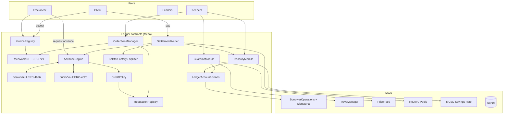
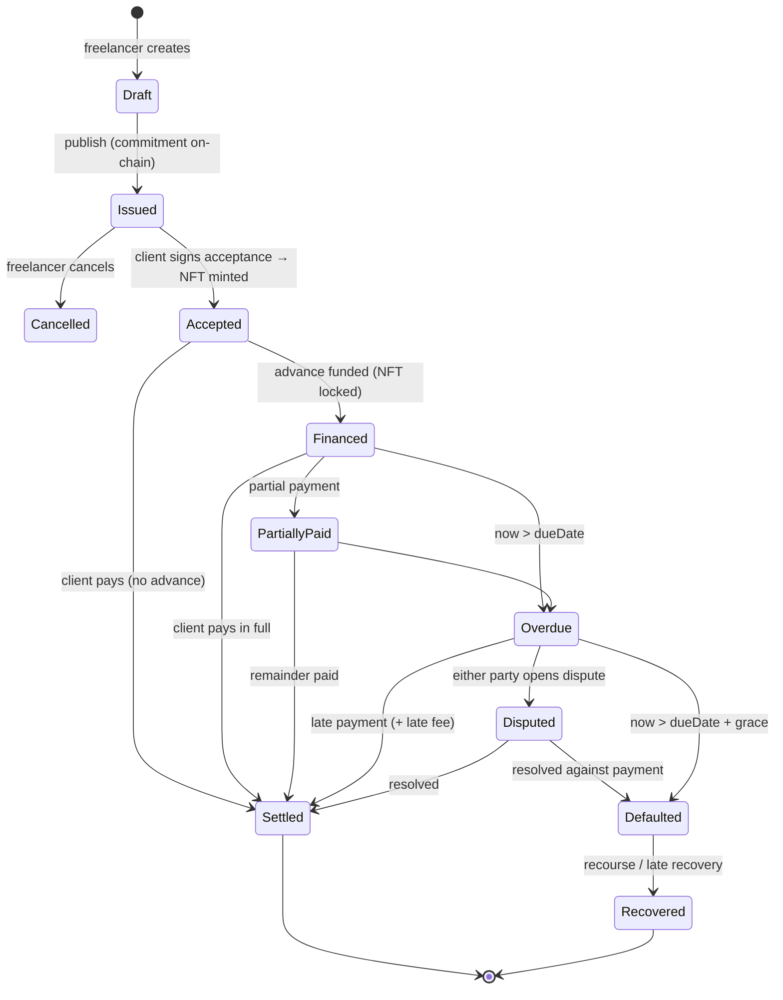

# Ledger — System Design

> **Get paid before your client pays.**
> Ledger is a Bitcoin-backed business account for freelancers and small agencies on Mezo. It turns accepted invoices into on-chain receivables, advances MUSD against them from a lender vault, and settles everything in MUSD.

| | |
|---|---|
| **Buildathon** | Mezo Buildathon (Wave 1: Oct 16–26, 2026 · Wave 2: Nov 2–15, 2026) |
| **Tracks** | Track 2 (Access & Distribution), primary · Track 1 (DeFi: lending/yield), secondary |
| **Chain** | Mezo testnet (Wave 1) → Mezo mainnet (capped) + Base payment intake (Wave 2) |
| **Assets integrated** | MUSD, BTC (native), MUSD CDP (BorrowerOperations / TroveManager / PriceFeed), Mezo Pools (Router), MUSD Savings Rate |
| **Doc version** | v1.0 — 2026-09-24 |

---

## Table of Contents

1. [Executive Summary](#1-executive-summary)
2. [Problem](#2-problem)
3. [Solution Overview](#3-solution-overview)
4. [Personas & User Journeys](#4-personas--user-journeys)
5. [Mezo Primitives Used (verified)](#5-mezo-primitives-used-verified)
6. [System Architecture](#6-system-architecture)
7. [Invoice & Receivable Lifecycle](#7-invoice--receivable-lifecycle)
8. [Smart Contract Design](#8-smart-contract-design)
9. [Credit Model: Advance Rates, Pricing, Recourse](#9-credit-model-advance-rates-pricing-recourse)
10. [Lender Vault (Senior / Junior Tranches)](#10-lender-vault-senior--junior-tranches)
11. [Keep-Your-BTC Settlement Path](#11-keep-your-btc-settlement-path)
12. [Treasury: Splits, Idle Yield, Auto-Paydown](#12-treasury-splits-idle-yield-auto-paydown)
13. [Position Guardian (Liquidation Protection)](#13-position-guardian-liquidation-protection)
14. [Default, Collections & Reputation](#14-default-collections--reputation)
15. [Privacy & Data Model](#15-privacy--data-model)
16. [Off-chain Services](#16-off-chain-services)
17. [Frontend / UX](#17-frontend--ux)
18. [Cross-chain Payment Intake (Base)](#18-cross-chain-payment-intake-base)
19. [Security & Threat Model](#19-security--threat-model)
20. [Testing Strategy](#20-testing-strategy)
21. [Repo Layout & Tech Stack](#21-repo-layout--tech-stack)
22. [Build Plan (Wave 1 / Wave 2)](#22-build-plan-wave-1--wave-2)
23. [Open Questions for the Mezo Team](#23-open-questions-for-the-mezo-team)
24. [Risks & Mitigations](#24-risks--mitigations)
25. [Legal & Compliance Notes](#25-legal--compliance-notes)

See also: [SUBMISSION_KIT.md](SUBMISSION_KIT.md) (form answers, deck, video script, GTM, business model).

---

## 1. Executive Summary

Freelancers wait **30–90 days** to get paid. Traditional invoice factoring fixes this, but it is slow, local, paperwork-heavy and unavailable to most cross-border freelancers.

**Ledger brings receivables financing on-chain, in MUSD:**

1. A freelancer issues an invoice. The **client accepts it on-chain**, which mints a **Receivable NFT**: a transferable, verifiable claim on a future MUSD payment.
2. The freelancer requests an **advance**. A lender vault funds up to **80%** of the invoice in MUSD immediately.
3. The client pays the invoice **through Ledger**. The payment repays the advance plus a fee, and the remainder goes to the freelancer, split automatically among collaborators if configured.
4. If the client pays in **BTC**, the freelancer can choose to **keep the BTC**: it becomes collateral in a MUSD position rather than being sold.
5. Idle MUSD in the account earns yield. That yield **pays down** the freelancer's MUSD debt automatically, and a guardian bot protects the position from liquidation.

**Why Mezo:** MUSD becomes the unit of account for real-economy cash flow (invoices, payroll, receivables). The lender vault gives MUSD holders a **real-world-yield** sink, and BTC holders get a reason to keep BTC on Mezo instead of selling.

---

## 2. Problem

| # | Pain | Who feels it |
|---|---|---|
| 1 | **Cash-flow gap:** work is done today, payment arrives in 30–90 days | Freelancers, agencies, contractors |
| 2 | **Factoring is inaccessible:** banks need local incorporation, credit history, and paperwork; cross-border invoices are rarely financed | Freelancers in emerging markets |
| 3 | **Sell-or-hold dilemma:** being paid in BTC forces a choice between spending (selling) and saving | Bitcoin-native workers |
| 4 | **No portable payment reputation:** a client's payment history lives in each freelancer's inbox | Everyone |
| 5 | **Stablecoin holders lack real-economy yield:** most MUSD yield is DeFi-reflexive | MUSD holders |

---

## 3. Solution Overview

```
 ┌─────────────┐  issue   ┌──────────────┐  accept (on-chain)  ┌─────────────────┐
 │ Freelancer  │ ───────▶ │   Invoice    │ ──────────────────▶ │ Receivable NFT  │
 └─────────────┘          └──────────────┘      Client         └────────┬────────┘
        ▲                                                               │ request advance
        │ 80% MUSD now                                                  ▼
        │                                                     ┌──────────────────┐
        └──────────────────────────────────────────────────── │  Lender Vault    │
                                                              │ (senior/junior)  │
                                                              └────────▲─────────┘
                                                                       │ principal + fee
 ┌─────────────┐  pays MUSD / BTC / USDC(Base)  ┌──────────────┐        │
 │   Client    │ ─────────────────────────────▶ │  Settlement  │ ───────┘
 └─────────────┘                                │   Router     │ ──▶ remainder → Splits → Freelancer
                                                └──────────────┘ ──▶ BTC? → Keep-BTC position
```

**Product modules**

| Module | What it does |
|---|---|
| **Invoicing** | Create an invoice or pay link; commitment hash on-chain, details encrypted off-chain |
| **Receivables** | Client acceptance mints an ERC-721 receivable with due date, amount, parties |
| **Advances** | Up to 80% in MUSD against an accepted receivable, priced by tenor and client score |
| **Lender Vault** | ERC-4626 senior/junior tranches that fund advances |
| **Settlement Router** | The only payment path: repays the advance, pays fees, routes the remainder |
| **Keep-BTC** | BTC payments go into a MUSD position as collateral instead of being sold |
| **Treasury** | Collaborator splits, idle-balance yield, automatic debt paydown |
| **Guardian** | Monitors the MUSD position and tops up or repays before liquidation |
| **Reputation** | On-chain payment score for clients (on-time rate, volume, disputes) |

---

## 4. Personas & User Journeys

| Persona | Goal | Journey |
|---|---|---|
| **Priya**, freelance designer (India) | Paid on net-60 by a US startup; needs rent money now | Issue invoice → client accepts → advance 80% → client pays at day 55 → remainder lands |
| **Mateo**, 3-person dev agency (Argentina) | Split every payment 50/30/20 automatically; hold BTC | Invoice in USD → client pays BTC → Keep-BTC mints MUSD → split to 3 wallets |
| **Acme Labs**, client company | Pay contractors transparently and build a good-payer reputation for better terms | Accepts invoices in one click, pays in MUSD or USDC on Base |
| **Sam**, MUSD holder | Yield backed by real-economy cash flow | Deposit in the senior tranche; earns advance fees |
| **Rhea**, risk-tolerant LP | Higher yield in exchange for first loss | Deposit in the junior tranche |

### 4.1 Journey A: advance on an invoice
```
1. Priya connects wallet → creates invoice: 2,000 MUSD, due in 60 days, client email/wallet
2. Ledger stores encrypted invoice details, posts commitment hash on-chain (Draft)
3. Client opens pay link → reviews → signs acceptance tx → Receivable NFT #57 minted to Priya
4. Priya clicks "Get paid now" → quote: 1,600 MUSD advance, fee 2.1% (≈33.6 MUSD) for 60 days
5. Priya confirms → NFT locked in AdvanceEngine → 1,600 MUSD sent to Priya
6. Day 55: client pays 2,000 MUSD via SettlementRouter
   → 1,600 principal + 33.6 fee → vault; 366.4 MUSD → Priya (via splits if set)
7. Receivable marked Settled; client's reputation score increases
```

### 4.2 Journey B: paid in BTC, keep the BTC
```
1. Mateo's invoice: $3,000. Client pays 0.03 BTC through the router
2. Mateo's preference = Keep-BTC at a target 250% collateral ratio
3. Router deposits BTC as collateral into Mateo's MUSD position and mints ~1,200 MUSD
4. MUSD → split 50/30/20 to the team. BTC stays owned by Mateo on Mezo
5. Treasury yield + a set % of future invoices auto-repay the MUSD debt over time
```

---

## 5. Mezo Primitives Used (verified)

Verified against `github.com/mezo-org/musd` (solidity/contracts) and Mezo docs.

### 5.1 Network
| | Testnet | Mainnet |
|---|---|---|
| Chain ID | 31611 | 31612 |
| RPC | `https://rpc.test.mezo.org` | Boar / Imperator / Validation Cloud / dRPC |
| Explorer | explorer.test.mezo.org | explorer.mezo.org |
| Gas token | BTC (native, 18 decimals) | BTC |
| EVM | London (compile with `evm_version = "london"`) | London |

### 5.2 MUSD CDP (Liquity-style, fixed-rate)
- Minimum collateral ratio **110%**, **fixed simple interest** set at open, refinancing to the global rate, and a redemption fee.
- Protocol interest and fees flow to the **MUSD Savings Rate** vault (`receiveProtocolYield`).

**Functions we call**
```solidity
// BorrowerOperations
function openTrove(uint256 _debtAmount, address _upperHint, address _lowerHint) external payable;
function addColl(address _upperHint, address _lowerHint) external payable;
function repayMUSD(uint256 _amount, address _upperHint, address _lowerHint) external;
function withdrawMUSD(uint256 _amount, address _upperHint, address _lowerHint) external;
function adjustTrove(uint256 _collWithdrawal, uint256 _debtChange, bool _isDebtIncrease,
                     address _upperHint, address _lowerHint) external payable;

// BorrowerOperationsSignatures: lets a relayer act for a user with an EIP-712 signature
openTroveWithSignature(...) · addCollWithSignature(...) · repayMUSDWithSignature(...)
adjustTroveWithSignature(...) · getNonce(address user)

// TroveManager
function getCurrentICR(address _borrower, uint256 _price) external view returns (uint256);
function getTroveDebt(address _borrower) external view returns (uint256);
function getTroveColl(address _borrower) external view returns (uint256);

// PriceFeed
function fetchPrice() external view returns (uint256);   // BTC/USD, 1e18

// HintHelpers / SortedTroves: compute insert hints for gas-efficient trove ops
```

**Key design implication:** positions belong to `msg.sender`. Ledger therefore uses **one of two patterns**:
- **Signature pattern (preferred):** the user's own wallet owns the position. Ledger's relayer submits `*WithSignature` calls authorized by the user's EIP-712 signature, so the position stays fully self-custodial.
- **Account pattern (fallback):** each user gets a minimal **LedgerAccount** smart wallet (a clone) that owns their position. Only the user and allowlisted Ledger modules may call it.

### 5.3 Mezo Pools (Router)
`swapExactTokensForTokens` and `getAmountsOut` for BTC↔MUSD conversions when a user chooses "convert" instead of "keep".

---

## 6. System Architecture



### 6.1 Component responsibilities

| Component | Responsibility |
|---|---|
| **InvoiceRegistry** | Invoice commitments (hash of encrypted terms), state machine, client acceptance |
| **ReceivableNFT** | ERC-721 minted on acceptance. `tokenURI` shows only non-sensitive fields (amount bucket, due date, status) |
| **AdvanceEngine** | Quotes, funds and tracks advances; locks the receivable while financed |
| **CreditPolicy** | Advance rate and fee as a function of the client score, tenor, amount, freelancer collateral |
| **ReputationRegistry** | Per-client and per-freelancer scores, updated only by SettlementRouter and CollectionsManager |
| **SettlementRouter** | The **only** way an invoice gets paid. Waterfall: vault principal → fee → protocol → splits/treasury |
| **Senior/Junior Vaults** | ERC-4626 tranches. The junior tranche absorbs first loss and earns a higher share of fees |
| **SplitterFactory** | Immutable percentage splits per invoice or per workspace |
| **TreasuryModule** | Idle-balance yield (MSR or senior vault); auto-paydown of the user's MUSD debt |
| **LedgerAccount** | Optional per-user smart account that owns the MUSD position (fallback pattern) |
| **GuardianModule** | Watches the ICR and tops up or repays from the treasury under user-set rules |
| **CollectionsManager** | Overdue → grace → default: recourse, junior write-down, reputation penalties |

### 6.2 Design principles
1. **Pay-through-router invariant:** an invoice is only "paid" if the money moved through `SettlementRouter`. Off-router payments do not settle a financed receivable (see Section 14 for disputes).
2. **Self-custody first:** positions are owned by the user or the user's own smart account; the protocol never custodies user BTC beyond what a financing contract requires.
3. **Minimal on-chain PII:** only hashes, amounts, due dates and addresses go on-chain (Section 15).
4. **Tranching over overcollateralization:** real-world credit risk is priced and absorbed by a junior tranche, not hidden.
5. **Composable receivables:** the ReceivableNFT is a standard ERC-721, so vaults, marketplaces or other protocols can price and hold it.

---

## 7. Invoice & Receivable Lifecycle



**Timings (defaults):** grace = 15 days; dispute window = before due date + 7 days; late fee = 1% per 15 days, capped at 5%.

**Acceptance semantics:** the client signs an EIP-712 `InvoiceAcceptance{invoiceId, commitment, amount, token, dueDate, payer}`. It can be submitted by anyone (relayer), so the client needs no gas. This is the client's on-chain acknowledgement of the obligation and the anchor for its reputation.

---

## 8. Smart Contract Design

### 8.1 Core structs
```solidity
enum InvoiceStatus { Draft, Issued, Accepted, Financed, PartiallyPaid, Overdue,
                     Disputed, Settled, Defaulted, Recovered, Cancelled }

struct Invoice {
    address issuer;          // freelancer (or their LedgerAccount)
    address payer;           // client wallet (0x0 = open until acceptance)
    bytes32 commitment;      // keccak256(encrypted terms blob || salt)
    uint128 amount;          // face value in MUSD (1e18)
    uint64  issuedAt;
    uint64  dueDate;
    uint128 paid;            // cumulative paid
    bytes32 splitId;         // optional splitter config
    InvoiceStatus status;
}

struct Advance {
    uint256 invoiceId;
    uint128 principal;       // MUSD advanced
    uint128 fee;             // fixed at funding (discount fee)
    uint64  fundedAt;
    uint16  advanceRateBps;
    uint128 recourseCollateral; // freelancer-posted collateral (BTC or MUSD), if any
    bool    closed;
}
```

### 8.2 InvoiceRegistry
```solidity
function createInvoice(address payer, bytes32 commitment, uint128 amount, uint64 dueDate, bytes32 splitId)
    external returns (uint256 invoiceId);
function cancelInvoice(uint256 invoiceId) external;                       // Issued only
function acceptInvoice(uint256 invoiceId, bytes calldata payerSig) external; // mints ReceivableNFT
function openDispute(uint256 invoiceId, bytes32 reasonHash) external;
event InvoiceCreated(uint256 indexed id, address indexed issuer, address indexed payer, uint128 amount, uint64 dueDate);
event InvoiceAccepted(uint256 indexed id, uint256 receivableId);
```

### 8.3 AdvanceEngine
```solidity
function quote(uint256 invoiceId) external view returns (uint256 maxAdvance, uint256 fee, uint16 rateBps);
function requestAdvance(uint256 invoiceId, uint256 amount, uint256 maxFee) external; // slippage-safe fee
function postRecourseCollateral(uint256 invoiceId) external payable;               // optional BTC
function onSettlement(uint256 invoiceId, uint256 amountIn) external onlySettlementRouter
    returns (uint256 toVault, uint256 toIssuer);
```

### 8.4 SettlementRouter (payment waterfall)
```solidity
function pay(uint256 invoiceId, uint256 amount) external;           // MUSD (permit supported)
function payWithBTC(uint256 invoiceId) external payable;            // native BTC
function payFromBridge(uint256 invoiceId, uint256 amount) external; // Wave 2: Base intake

// Waterfall on each payment:
//  1. if Financed: principal outstanding → vaults (senior first, junior next)
//  2. discount fee → vaults (junior gets its boosted share) + protocol cut
//  3. late fee (if any) → vaults
//  4. remainder → issuer preference: Splitter | Treasury | Keep-BTC | wallet
```
BTC payments are valued with `PriceFeed.fetchPrice()`, with staleness and deviation guards. If the issuer chose **Keep-BTC**, BTC goes to their position (Section 11); otherwise it is swapped to MUSD through the Router with an oracle-bounded `minOut`.

### 8.5 CreditPolicy (pluggable)
```solidity
function terms(address payer, address issuer, uint256 amount, uint64 tenorDays, uint256 recourseValue)
    external view returns (uint16 advanceRateBps, uint16 feeBps, bool eligible);
```

### 8.6 ReputationRegistry
```solidity
struct Score { uint32 invoices; uint32 onTime; uint32 late; uint32 defaults; uint128 volume; uint64 lastUpdate; }
function clientScore(address payer) external view returns (uint16 score0to1000);
function record(address payer, address issuer, uint256 amount, int64 daysLate, bool defaulted) external onlySettlementOrCollections;
```
Score formula (v1, transparent):
`score = 1000 × onTimeRate × volumeFactor × recencyFactor − 250 × defaults`, clamped to 0–1000, where `volumeFactor = min(1, log10(volume)/5)` saturates around $100k.

### 8.7 Splitter
Minimal clone per split config: `recipients[] + bps[]` (sum = 10,000), immutable once used, with a push-or-pull payout fallback when a recipient rejects the transfer.

### 8.8 Events for the indexer
`InvoiceCreated, InvoiceAccepted, AdvanceFunded, PaymentReceived(id, payer, amount, token), Settled, Overdue, DisputeOpened, Defaulted, Recovered, TrancheLoss, ScoreUpdated, GuardianAction, TreasuryPaydown`.

---

## 9. Credit Model: Advance Rates, Pricing, Recourse

### 9.1 Client tiers (from ReputationRegistry)
| Tier | Client score | Max advance rate | Fee per 30 days | Recourse collateral required |
|---|---|---|---|---|
| **New** | no history | 50% | 2.0% | **100% of the advance** (in BTC/MUSD) |
| **Bronze** | 1–499 | 60% | 1.6% | 50% |
| **Silver** | 500–799 | 70% | 1.2% | 20% |
| **Gold** | 800+ | 80% | 0.9% | 0% |
| **Verified business** (Wave 2, off-chain KYB attestation) | any | 80% | 0.8% | 0% |

**Recourse:** Ledger uses **recourse factoring**: if the client defaults, the freelancer's posted collateral repays the vault first. This is how a brand-new client can still be financed on day one without making lenders underwrite unknown counterparties.

### 9.2 Fee formula
```
fee = amountAdvanced × feePer30d × ceil(tenorDays / 30)      (min tenor 7d, max 120d)
maxAdvance = min(faceValue × advanceRate,
                 exposureCap(payer),          // per-client concentration limit
                 vaultAvailableLiquidity)
```

### 9.3 Worked example
| Input | Value |
|---|---|
| Invoice | 2,000 MUSD, 60-day tenor |
| Client | Silver (score 640) → 70%, 1.2%/30d, 20% recourse |
| Max advance | 1,400 MUSD |
| Fee | 1,400 × 1.2% × 2 = **33.6 MUSD** |
| Recourse collateral | 20% × 1,400 = 280 MUSD worth of BTC |
| On payment | 1,400 + 33.6 → vault; 566.4 → freelancer |
| Lender yield | ≈ 7.3% APR on deployed capital at this tier |

### 9.4 Portfolio limits
- Per-client exposure cap: `min(25k MUSD, 10% of vault TVL)`.
- Per-freelancer open advances: at most 5 (Wave 1).
- Max tenor: 120 days.
- Circuit breaker: pause new advances if the 30-day default rate exceeds 5%.

---

## 10. Lender Vault (Senior / Junior Tranches)

| | Senior (`lsMUSD`) | Junior (`ljMUSD`) |
|---|---|---|
| Standard | ERC-4626 | ERC-4626 |
| Loss position | Second loss | **First loss** |
| Fee share | 70% of advance fees | 30% of advance fees (on a smaller base, so higher APR) |
| Constraint | Senior deployment ≤ 4 × junior TVL (keeps a 20% subordination) | — |
| Idle cash | Parked in the MUSD Savings Rate (floor yield) | Same |
| Withdrawals | Instant up to idle liquidity; otherwise an async request queue filled as invoices settle | Same, plus a 7-day notice |

**Accounting:** `totalAssets = idle + inMSR + Σ outstanding principal + accrued fees − provisions`. Fees accrue linearly over the tenor to avoid share-price jumps at settlement.

**Loss waterfall on default:** recourse collateral → junior share price haircut → senior share price haircut (only if junior is exhausted). Every step emits a `TrancheLoss` event.

---

## 11. Keep-Your-BTC Settlement Path

When a client pays in BTC and the issuer's preference is **Keep-BTC**:

```
BTC in → value via PriceFeed →
 if issuer has no position: openTrove(debt = value × 1/targetCR, hints) with the BTC as collateral
 else: addColl + withdrawMUSD to keep the target CR
 MUSD out → waterfall (repay the advance first if the invoice was financed) → splits/treasury
```

**Self-custody options:**
- **Signature pattern:** during onboarding the user signs a scoped EIP-712 authorization. For each BTC payment, the relayer calls `openTroveWithSignature` / `addCollWithSignature` so the position is owned by the **user's EOA**. Signatures carry nonces and deadlines; a user signs a fresh one per settlement or a bounded session.
- **Account pattern:** BTC goes to the user's **LedgerAccount**, which owns the position. The user can always call `LedgerAccount.execute` to manage or close it directly.

**Defaults:** target CR 250% (well above the 110% MCR), configurable from 200% to 400%. Must respect MUSD's minimum debt; if a single payment is too small, BTC accumulates in the account until the threshold is met.

---

## 12. Treasury: Splits, Idle Yield, Auto-Paydown

- **Splits:** each workspace or invoice can route its remainder to a Splitter (e.g., 50/30/20).
- **Idle yield:** MUSD sitting in a user's Ledger balance can be swept to (a) the MUSD Savings Rate or (b) the Ledger Senior Vault, where it funds other freelancers' invoices. This closes the loop: *freelancers finance freelancers*.
- **Auto-paydown:** users set a rule: "apply X% of every incoming payment plus all treasury yield to repay my MUSD debt." A keeper executes `repayMUSD` (or `repayMUSDWithSignature`) weekly. The dashboard shows a **debt-free date** projection.

---

## 13. Position Guardian (Liquidation Protection)

User-configured rules, executed by permissionless keepers for a small bounty:

| Trigger | Action (in order) |
|---|---|
| ICR < warning (default 180%) | Telegram/email alert |
| ICR < action (default 150%) | Repay debt from treasury MUSD until ICR ≥ target |
| Still < action | Pull MUSD from the senior-vault position (instant liquidity only), then repay |
| ICR < critical (default 125%) | Add BTC collateral from a user-pre-approved BTC buffer |

The guardian reads `TroveManager.getCurrentICR(user, PriceFeed.fetchPrice())`. Each action is bounded by per-day limits the user signs once, and the guardian can **only** reduce risk (repay or add collateral), never borrow or withdraw.

---

## 14. Default, Collections & Reputation

1. **Overdue** (after the due date): client and freelancer are notified; the late fee starts accruing.
2. **Grace** (15 days): the client can still pay. The freelancer may top up recourse collateral voluntarily.
3. **Default:** `CollectionsManager.default(invoiceId)` is callable by anyone after the grace period:
   - Seize recourse collateral → vault.
   - The remaining loss hits junior, then senior.
   - The client's reputation takes a `defaults++` penalty. The public ReceivableNFT stays as a verifiable record of the unpaid obligation.
   - The receivable is transferred to the vault, so any **late recovery** (payment after default) flows to the tranches that took the loss.
4. **Disputes (v1):** either party can flag a dispute with an evidence hash. Wave 1 uses a 2-of-3 resolver multisig (Ledger team plus two community resolvers). Wave 2 explores an arbitration integration.
5. **Off-router payments:** if the client pays the freelancer directly while the invoice is financed, the freelancer must forward the funds through `repay(invoiceId)`. Failing to do so counts against the **freelancer's** score and triggers recourse.

---

## 15. Privacy & Data Model

| Data | Where | Why |
|---|---|---|
| Line items, descriptions, names, emails, tax IDs | **Off-chain**, encrypted (AES-GCM; key shared via the pay link fragment `#k=…`) | PII never touches the chain |
| `commitment = keccak256(ciphertext ‖ salt)` | On-chain | Tamper-evidence: anyone holding the link can verify the terms |
| Amount, token, due date, payer, issuer | On-chain | Needed for financing, settlement and reputation |
| Reputation aggregates | On-chain | Portable, verifiable |
| Files (PDF invoice) | IPFS (encrypted) or backend object store | Optional |

Share links use a URL **fragment** for the decryption key so it is never sent to the server. Auditor export: the user can export a signed bundle (invoice JSON + ciphertext + salt + tx hashes) that proves settlement without revealing the rest of their history.

---

## 16. Off-chain Services

| Service | Stack | Responsibility |
|---|---|---|
| **API** | Node/TypeScript (Hono or Express) + Postgres (Supabase) | Encrypted invoice blobs, workspaces, email notifications, pay-link resolution |
| **Relayer** | viem + an OpenZeppelin Defender-style signer | Submits client acceptances and `*WithSignature` position ops (gasless UX) |
| **Indexer** | Ponder | Invoices, advances, payments, scores, vault stats |
| **Keepers** | Node cron + on-chain bounties | Overdue/default transitions, guardian actions, auto-paydown, vault queue fills |
| **Notifier** | Resend (email) + grammY (Telegram) | "Invoice accepted", "Advance funded", "Payment received", "ICR warning", "Due in 3 days" |
| **Pricing** | Mezo PriceFeed + Router quotes | USD↔BTC display and settlement bounds |

The backend **never** holds user private keys. Relayer keys only pay gas and can only submit user-signed payloads.

---

## 17. Frontend / UX

**Stack:** Next.js 15 (App Router), TypeScript, wagmi + viem, RainbowKit (Mezo chain config from `mezo-org/chains`), Mezo Passport for BTC-wallet users, Tailwind + shadcn/ui, Recharts, React-PDF for invoice export.

**Screens**
1. **Home:** balance (MUSD + BTC position), "Get paid now" call to action, upcoming receivables timeline.
2. **Create invoice:** client, line items, currency display (USD/BTC), due date, split preset, Keep-BTC toggle.
3. **Pay page (client):** a clean, no-crypto-jargon checkout: "Accept invoice" → "Pay with MUSD / BTC / USDC on Base". It also works without connecting until payment.
4. **Advance drawer:** tier badge for the client, max advance, fee, recourse needed, payout ETA.
5. **Receivables:** the portfolio, with statuses and days to due date.
6. **Position:** BTC collateral, MUSD debt, ICR gauge, guardian rules, debt-free date.
7. **Lend:** senior/junior vault cards, APY, utilization, default rate, loss history.
8. **Reputation:** public client score page (a shareable "Good Payer" badge for clients).

**UX rules:** show dollars first and crypto second; one primary action per screen; every fee shown before signing; mobile-first pay page; clients never need gas.

---

## 18. Cross-chain Payment Intake (Base)

MUSD is bridged to Ethereum and Base via **Wormhole NTT**. Many clients hold USDC on Base.

**Wave 2:**
1. A `BasePayGateway` contract on Base accepts **MUSD or USDC** for an invoice ID.
2. USDC → MUSD swap on a Base DEX (Aerodrome MUSD pools where liquidity exists).
3. MUSD is bridged to Mezo via NTT with a payload `{invoiceId}`, and `SettlementRouter.payFromBridge` settles it.
4. Until the bridge message lands, the invoice shows **"Payment in transit"**; the due-date clock stops when the Base-side transaction confirms.

This lets a company on Base pay a freelancer on Mezo in one click, which widens MUSD distribution.

---

## 19. Security & Threat Model

| # | Threat | Mitigation |
|---|---|---|
| 1 | **Fake client / self-dealing** (freelancer accepts their own invoice from a second wallet to farm advances) | New-client tier requires 100% recourse, so there is no free money; per-issuer caps; sybil heuristics (fresh-wallet, funding-source checks) in CreditPolicy v2; reputation weighted by the volume actually paid |
| 2 | **Wash-trading reputation** (paying yourself on time to raise a score) | Score weighted by independent counterparties plus volume; score gains decay; advances only unlock above a minimum distinct-issuer count |
| 3 | **Off-router payment** (client pays the freelancer directly) | Freelancer-side recourse plus a reputation penalty; the UI makes the router the only visible way to pay |
| 4 | **Oracle manipulation** on BTC payments | PriceFeed plus a Router TWAP sanity check, staleness < 1h, deviation < 3% |
| 5 | **Swap sandwich** on BTC→MUSD | Oracle-bounded `minOut`, max slippage 0.5%, a per-transaction size cap |
| 6 | **Signature replay** (`*WithSignature`, acceptance) | EIP-712 domain separation, nonces (`getNonce`), deadlines, chain ID |
| 7 | **Reentrancy** via ERC-721/ERC-4626 hooks, BTC transfers | `nonReentrant`, checks-effects-interactions, pull-payment fallback for splits |
| 8 | **Vault inflation attack** | OZ 4626 virtual-shares offset plus a seeded dead-shares deposit |
| 9 | **Bad-debt cascade** | Junior subordination ≥ 20%, per-client caps, default-rate circuit breaker |
| 10 | **Guardian abuse** | Guardian can only repay or add collateral, within user-signed daily limits |
| 11 | **Admin key risk** | 2/3 multisig + 48h timelock on parameters; a pause guardian that cannot move funds; immutable settlement waterfall |
| 12 | **PII leak** | Encryption keys only in URL fragments; the backend stores ciphertext; logs scrubbed |
| 13 | **Bridge failure** (Base intake) | Timeout refund path on Base; the invoice due clock pauses; per-message caps |
| 14 | **Front-running acceptance** | Acceptance bound to a specific payer signature and commitment |

**Invariants (Foundry):**
- `Σ outstanding principal ≤ senior.totalAssets + junior.totalAssets`.
- A financed receivable NFT is always held by AdvanceEngine until Settled or Defaulted.
- `invoice.paid ≤ invoice.amount + lateFees`.
- The settlement waterfall always pays vault principal before issuer remainder.
- Senior deployment ≤ 4 × junior TVL.
- The guardian never increases a user's debt.

---

## 20. Testing Strategy

| Layer | Tooling | Target |
|---|---|---|
| Unit | Foundry | ≥ 95% line coverage on core contracts |
| Fuzz | Foundry fuzz (amounts, tenors, partial payments, late payments) | 10k runs |
| Invariant | Foundry handlers for Section 19 invariants | all green |
| Fork | `--fork-url https://rpc.test.mezo.org` against real BorrowerOperations / TroveManager / PriceFeed | open/adjust/repay position via signatures |
| Static | Slither + Aderyn in CI | 0 high / 0 medium unresolved |
| API | Vitest + Supertest | auth, encryption round-trip, pay-link resolution |
| E2E | Playwright | create → accept → advance → pay → settle → score update |
| Scenario sim | TypeScript sim of 1,000 invoices with a configurable default rate | tranche APY and loss curves for the deck |

---

## 21. Repo Layout & Tech Stack

```
ledger/
├─ contracts/                     # Foundry (solc 0.8.24, evm_version = london)
│  ├─ src/
│  │  ├─ invoices/InvoiceRegistry.sol
│  │  ├─ invoices/ReceivableNFT.sol
│  │  ├─ credit/AdvanceEngine.sol
│  │  ├─ credit/CreditPolicy.sol
│  │  ├─ credit/ReputationRegistry.sol
│  │  ├─ credit/CollectionsManager.sol
│  │  ├─ settlement/SettlementRouter.sol
│  │  ├─ settlement/SplitterFactory.sol
│  │  ├─ vaults/SeniorVault.sol
│  │  ├─ vaults/JuniorVault.sol
│  │  ├─ treasury/TreasuryModule.sol
│  │  ├─ treasury/GuardianModule.sol
│  │  ├─ accounts/LedgerAccount.sol
│  │  └─ interfaces/ (IBorrowerOperations, IBorrowerOperationsSignatures, ITroveManager, IPriceFeed, IRouter)
│  ├─ test/{unit,fuzz,invariant,fork}/
│  └─ script/Deploy.s.sol
├─ apps/web/                      # Next.js dApp (freelancer + client pay page + lend)
├─ apps/api/                      # invoice storage, relayer, notifications
├─ apps/bot/                      # Telegram notifier
├─ services/keepers/              # overdue/default, guardian, paydown, vault queue
├─ indexer/                       # Ponder
├─ base-gateway/                  # Wave 2: Base payment intake
├─ docs/
└─ .github/workflows/ci.yml
```

**Stack:** Solidity 0.8.24 · Foundry · OpenZeppelin 5 · Next.js 15 · wagmi/viem · RainbowKit · Mezo Passport · Tailwind/shadcn · Ponder · Supabase/Postgres · grammY · Resend · Wormhole NTT (Wave 2) · Slither/Aderyn.

---

## 22. Build Plan (Wave 1 / Wave 2)

### Before Wave 1 (now → Oct 15)
- [ ] Discord: confirm the open questions in Section 23.
- [ ] Testnet: faucet BTC, open a MUSD position manually, try `openTroveWithSignature` from a script.
- [ ] Scaffold the monorepo, CI, interfaces, and mocks for PriceFeed and BorrowerOperations.

### Wave 1 (Oct 16–26): "Invoice → advance → settle works end to end"
| Days | Deliverable |
|---|---|
| 16–17 | InvoiceRegistry + ReceivableNFT + EIP-712 acceptance; unit tests |
| 18–19 | AdvanceEngine + single Senior vault + CreditPolicy (New/Gold tiers); recourse in MUSD |
| 20 | SettlementRouter (MUSD payments), Splitter |
| 21 | Deploy to Mezo testnet; API with encrypted invoice blobs |
| 22–23 | Web: create invoice, client pay page, advance drawer, lend page |
| 24 | ReputationRegistry v1 + public score page; indexer |
| 25 | Demo run with real testnet transactions; video + deck |
| 26 | Submit |

**Wave 1 cut line:** MUSD-only payments, a single vault, two credit tiers, no BTC path, no guardian.

### Wave 2 (Nov 2–15): "Keep-BTC, tranches, protection, Base"
- Keep-BTC path via `*WithSignature` (or LedgerAccount).
- Senior/junior tranches + CollectionsManager + dispute multisig.
- GuardianModule + auto-paydown + Telegram alerts.
- BasePayGateway (USDC/MUSD on Base → NTT → Mezo).
- Invariant tests, Slither clean, threat-model doc, scenario-sim charts.
- Capped mainnet deployment.
- A **"What changed since Wave 1"** section at the top of the submission.

---

## 23. Open Questions for the Mezo Team

1. `BorrowerOperationsSignatures` testnet address, and whether third-party relayers may submit `openTroveWithSignature`. Can the signer be a smart account (EIP-1271)?
2. The current **minimum net debt** and borrowing fee for MUSD positions on testnet and mainnet.
3. PriceFeed address and oracle provider; heartbeat and staleness expectations.
4. MUSD Savings Rate: can third-party contracts deposit, and what is its address?
5. Testnet MUSD/BTC pool liquidity for the Router swap path.
6. Wormhole NTT for MUSD on Base: is custom payload or message passing supported for `{invoiceId}` routing, or do we need a separate messaging layer?
7. Any recommended KYB/attestation provider in the Mezo ecosystem (for the Verified business tier).

---

## 24. Risks & Mitigations

| Risk | Impact | Mitigation |
|---|---|---|
| Few real clients on testnet | Weak demo of reputation | Seed scripted client wallets; show the scoring math transparently; recruit 5 real freelancer–client pairs from our network for Wave 2 |
| Credit risk looks scary to judges | Lower viability score | Recourse by default, junior first loss, caps, circuit breaker, a public sim |
| Signature-based position ops not relayer-friendly | Keep-BTC path blocked | LedgerAccount fallback |
| Scope creep | Late submission | Hard Wave 1 cut line (Section 22) |
| Legal perception of factoring | Business viability questions | Section 25; position as a protocol with regulated partners for off-chain enforcement later |

---

## 25. Legal & Compliance Notes

- On-chain acceptance is an **acknowledgement**, not automatically a legally enforceable contract in every jurisdiction. Wave 2 adds optional off-chain e-signature of standard invoice terms that reference the on-chain commitment.
- Large advances (e.g., above $10k per client) will require KYB of the client in the "Verified business" tier.
- Ledger does not custody fiat. All settlement is MUSD/BTC on-chain; any off-ramp is left to third-party providers.
- Sanctions screening on payer and issuer addresses via an address-screening API before advances.
- Nothing here is legal advice. A legal review is planned before mainnet scaling.
